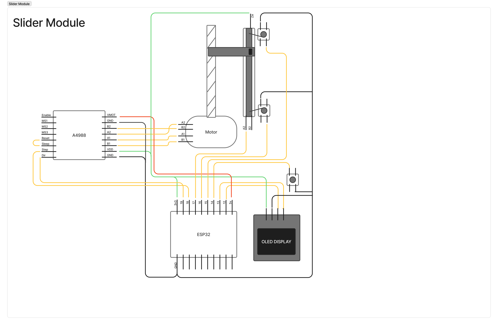
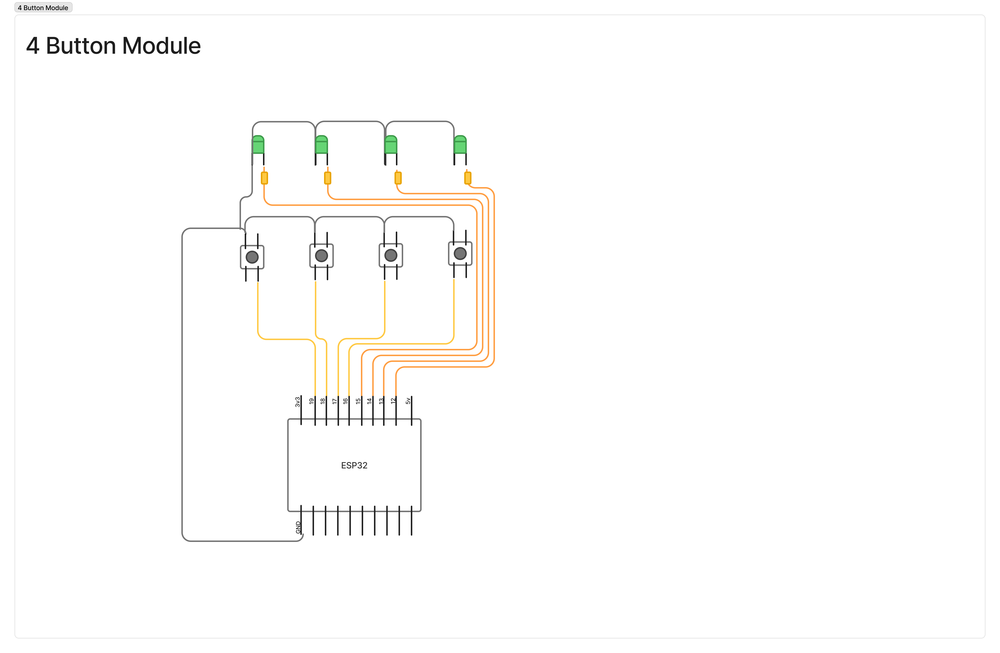

Este projeto tem como objetivo criar um dispositivo modular para conectar ao windows e controlar funçoes do SO e aplicativos como volume independente por aplicacao, criar perfis e atalhos de aplicacoes.

Tecnologias utilizadas:

Interface com usuário: 
[Windows UI](https://github.com/microsoft/WindowsAppSDK)

[Prototipação Esquema Físico](https://www.figma.com/board/FpcnRfROIaRzgwp1n8VSdE/Next?node-id=0-1&p=f&t=ITFdHt1tavWwVhDP-0):

### Hardware:
- ESP 32
- Potenciometro deslizante (futuramente com motor)
- Potenciometro normal
- Botao de acionamento (Futuramente com display)

### Message transmition:

Por causa do projeto envolver mais de um modulo conectado a um módulo principal, é necessário um formato de transmissão otimizado. No caso iremos trabalhar com uma transmissão de informação de **16 bits** seguindo a seguinte tabela: 

| 000 | 0 | 0000 | 00000000 |
| --- | --- | --- | --- | 
| Module Index | In/Out | Action | Parameter Value |

- **Module Index**: se refere à posição em que o módulo está em relação ao módulo principal (o Módulo principal é sempre o primeiro módulo, index = 0);
- **In/Out**: é o bit que vamos dizer se o dado está saindo do computador ou do módulo **`0 = computer`,  `1 = module`**
- **Action**: dentro do módulo temos uma seleção de funções que podem ser executadas, definidas pelo action. exemplo: action 0001 = Deslizar potênciometro para posição X
- **Parameter Value**: define o valor que será enviado para executar a função referente à action. Exemplo: o valor de X (o valor para qual o potenciometro será deslizado)

#### Default Indexes
- **000**: Computer
- **001**: main module

#### Default Actions

- **0000**: solicitação de conexão
- **1111**: 

#### Default module types
| Bits | Module  | 
| ---- | ------  | 
| 0001 | Buttons | 
| 0010 | Slider  | 
| 0011 | Rotative| 
| 0100 | 3 pots  | 

##### Connection request
Para solicitação de conexão o módulo tem que enviar para o computador seu tipo de módulo (slider, button, rotativo...) a porta **Wire 1 é sempre para solicitação de conexão**

